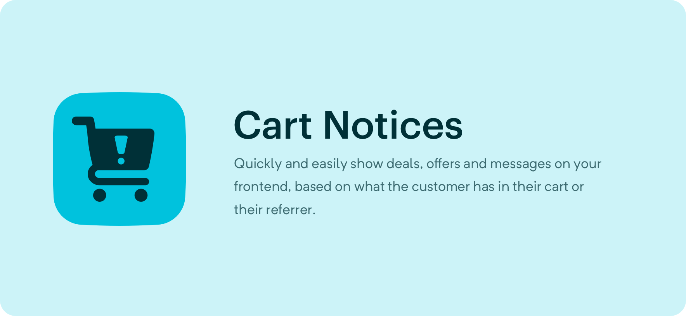

# Cart Notices
Automatically show notices based off cart details

#### Currently Supports:
- **Minimum Amount**: Show a notice based of the cart total
- **Deadline**: Show a notice on a given day of the week and time
- **Referer**: Show a notice to customers coming from a given referer
- **Products in cart**: If the user has specific products (within a given quantity) in their cart
- **Categories in cart**: Are any products or purchasables in the cart related to at-least one of these categories  

## Usage

You can perform an element query on the notices using:

```twig

```

As well as supporting the [generic parameters for element queries](https://docs.craftcms.com/v3/dev/element-queries/#executing-element-queries)
notices support some additional ones:

### `type`

Specify the type of notice you want to show. Can be a string or an array of 
strings. Must match the handles of the [notice types](https://github.com/ethercreative/cart-notices/blob/master/src/enums/Types.php#L25-L29).

```twig

``` 

### `filter`

Defines whether or not we should filter the notices by the currently active cart
(or the cart passed to `cart`). If true, all notices will be checked against the
cart to see if they should show. Defaults to true.

```twig
{# This will show all notices regardless of the cart #}

```

### `cart`

What cart (or order) should we filter the notices against? Defaults to the 
currently active cart.

```twig

```